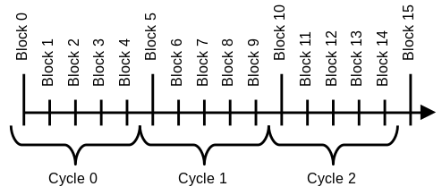
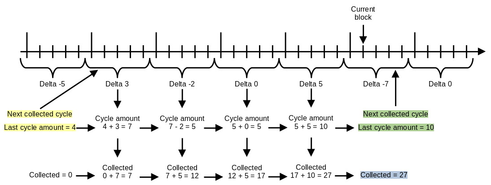
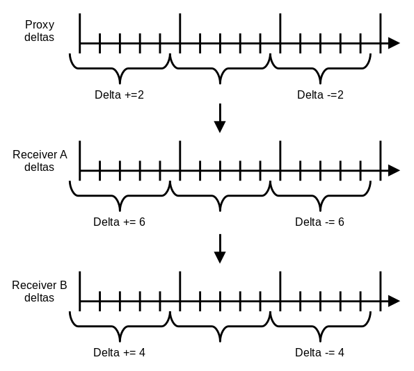
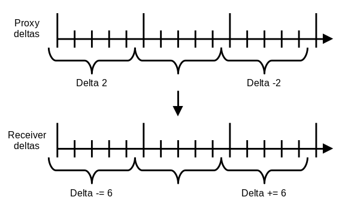

This document is an introduction to understanding how the funding pool contract works.
It doesn't describe all the implementation details or the API,
it focuses on the basic principles of the core mechanics.

# Overview

The funding pool is a smart contract which creates real-time streams of donations.
One can start, alter or end the process of sending their funds at any time with immediate effect.
The flow of funds is automatically maintained and steady over time.

There are 3 roles present in the contract.
Any Ethereum address can simultaneously take on any of these roles.

- **The sender**: has assets and chooses who do they want to send them to, how much, and how fast
- **The receiver:** receives funds from senders
- **The proxy**: receives funds from senders, but immediately passes them to receivers of their choice

## The cycles

The whole blockchain history is divided into cycles of equal length.
Every cycle contains the same, constant number of blocks.
In the examples below, we assume that the cycle length is 5.

# The receiver

The receiver requires no preparation, any address can receive donations at any time.
The only function of this role is collection of funds sent by others.

## The deltas

On every block, a sender can send funds to a receiver.
The receiver can collect funds sent on a given block only when the cycle containing it is over.

Here we have a history of a receiver, who has 2 senders.
Each of them was sending different amounts over different periods of time.
On the end of each cycle, the collectable amount was increased by the total sent amount.

Each receiver needs to know, how much was sent to them.
To accomplish that the history of received funds needs to be stored in some form.
The receiver doesn't care, who exactly is sending on each block and in what configuration.
The only thing that matters are the collectable per-cycle values below the timeline.
This reduces the amount of stored data significantly, but this can be optimized further.

In this example, we started with having the raw collectable value of 23 for every block until
the end of the blockchain.
We then reduced that to storing values added to the collectable amount on each cycle.
Now we need to describe only cycles when receiving anything.
The senders usually are sending constant per-cycle amounts over long periods of time, so
the added values tend to create long series of constant numbers, in this case, 5s.
We exploit that and turn them into deltas relative to the previous cycles.
Now we need deltas only for cycles where the sending rate changes, it's very cheap.
This is what the contract actually stores: a mapping from cycle numbers to deltas.

## Collecting

When the receiver wants to collect the funds, they can iterate over the finished cycles, reconstruct
the added values from deltas and then calculate the collectable amount at this point in time.
For any cycle before the first funding begins the added value is assumed to be 0.

# The sender

The sender has a balance and a set of parameters, which describe the sending process.

The balance can be increased by topping up, which requires sending the assets to the contract.
The currently unspent balance can be withdrawn and transferred out of the contract at any time.

The overall rate of funding of the sender is described with the amount per block.
It limits the value, which can be taken from the balance on each block and sent to the receivers.
This value stays constant over time unless explicitly updated.

The sender maintains a list of receivers too, each of them with a weight.
The weights regulate how the per-block amount is split between the receivers.
For example, a receiver with weight 2 is going to get a share twice as big
as a receiver with weight 1, but only half as big as another receiver with weight 4.

## Starting sending

When the sender has a sufficient balance, a sending rate and a list of receivers, sending starts.
First, the funding period is calculated.
Its start is the current block and its end is the block on which the balance will run out.
Next, for each receiver the weighted share of the per-block rate is calculated.
The receiver's deltas are updated to reflect that during the whole sending period on every block
it's going to receive the calculated amount.

Let's take a look at an example of an application of a delta.
The sender will be sending 1 per block or 5 per cycle.

The deltas are applied relative to the existing values.
It doesn't matter if anybody else is funding the receiver, it won't affect this sender.

Another important point is that the delta changes are usually split between two cycles.
This reflects that the first cycle is only partially affected by the change in funding.
Only the second one is fully affected and it must apply the rest of the delta.

In this case, the total change of the per-cycle delta is +5 to start sending.
The current cycle isn't fully affected though, only 2 out of 5 blocks are sending.
It's effectively going to transfer only the amount of 2, which is reflected in the +2 delta change.
On the other hand, the next cycle and the ones after it are going to transfer the full 5.
This is expressed with the +3 delta change, which turns 2 per cycle into the full 5 per cycle.

## Stopping sending

When funding stops, the deltas need to be reverted.
To do that basically the same process is applied, just with negative deltas.

In this case, the reverting is split into 2 cycles too, one with -4 and the other with -1.

Let's assume that a few blocks have passed, but the sender wants to stop sending.
This can happen because the sender doesn't want to fund the receiver anymore
or because they want to change some of its configuration.
In the latter case sending is stopped only to be immediately resumed, but with different parameters.
Either way, the effects of the sender on the receiver's deltas need to be reverted
from the current block to the end of the existing funding period.

The old funding end deltas are reverted because they don't reflect the real funding end anymore.
On the other hand, a new end is applied to the current block,
just as if it was always supposed to be the end of the funding period.
Now the receiver's future isn't affected by the sender anymore.
The past stays untouched because the already sent funds are out of the sender's control.

# The proxy

The proxy is configured only with a list of weighted receivers.
It's not possible to send funds via a proxy which isn't configured.
The sum of the receivers' weights must always be a constant value,
which is defined in the contract and it's the same for all the proxies.

Just like a receiver, the proxy has a mapping between the cycles and the deltas of received amounts.

## Sending via a proxy

When a sender starts sending funds to a proxy, it does so in two steps.
First it applies changes to the proxy's deltas similarly to how it would do with a receiver.
Next, it iterates over all the proxy's receivers and applies changes to
their deltas as if they were directly funded by the sender.
The funding rate applied to the receivers is split according to their weights in the proxy.

For the example sake let's assume that the delta's proxy weights sum must be equal 5.
The proxy has 2 receivers: A with weight 3 and B with weight 2.
The sender wants to start sending via the proxy 2 per block or 10 per cycle.
It's 2 per cycle per proxy weight.

The proxy's deltas store amount per 1 proxy weight, which is 2.
The receivers get their shares, A with weight 3 gets 6 and B with weight 2 gets 4 per cycle.

When a sender stops sending, the process is reversed like with regular receivers.
All the deltas are once again applied, but with negative values.

## Updating a proxy

When the list of proxy receivers is updated, all funding must be moved to a new set of receivers.
That's when the proxy's deltas come useful.
For each cycle and each receiver, the proxy can tell, what total delta it has applied.
It can then use this information to erase its influence from its receivers.

In this example, the receiver's weight is 3.
To erase the influence, the proxy's deltas are multiplied by
the receiver's weights and subtracted from the corresponding receiver's deltas.

After removing its influence from one set of receivers the proxy must reapply itself on a new set.
This is done in the same way as removal, but this time the deltas are added and not subtracted.

### The current cycle problem

Unlike the senders, the proxies store data with a per-cycle precision.
When changing the set of receivers, a delta describing the current cycle may need to be applied.
When it happens, it's unclear, what part of the per-cycle delta should be moved,
because some funds were sent before the current block and some will be sent after it.

The solution is to ignore the problem and move the whole current cycle delta.
Some funds already sent in the current cycle may disappear from one receiver and appear in another,
but it's not dangerous, the receivers have no access to funds coming from an unfinished cycle.
The senders aren't strongly affected either, they already sent these funds and they trust the proxy.
